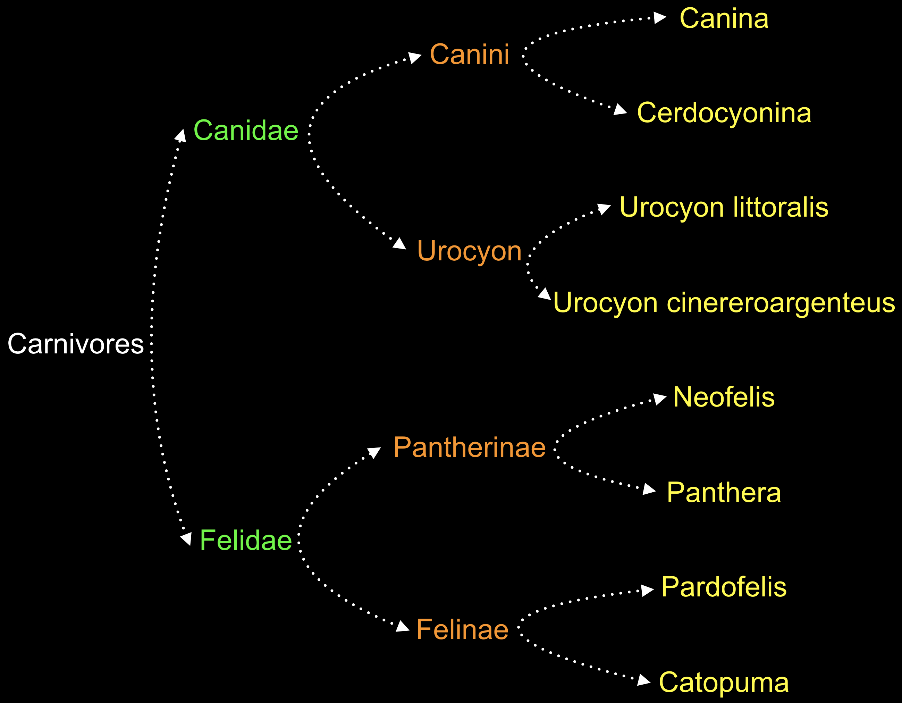

# Collection Types (Array, Dictionary, Set)

<br>

<br>

### Return the array of people that has "E" in their favorite fruits

```swift
let appleLeadershipAndTheirFavoriteFruits = [
					     "Steve Jobs"        : "Apple",
                                             "Steve Wozniak"     : "Pineapple",
                                             "Jonathan Ive"      : "Kiwi",
                                             "Philip W. Schiller": "Mango",
                                             "Craig Federighi"   : "Fig",
                                             "Chris Lattner"     : "Avocado",
                                             "Jeff Williams"     : "Raspberry",
                                            ]

func getlistOfHasE(in list: Dictionary<String, String>) -> Array<String> {
    var listOfPeopleHasEInTheirFavoriteFruit = Array<String>()
    
    for (person, fruit) in list {
        let hasE = fruit.lowercased().contains("e") ? true : false
      	
        if hasE {
            listOfPeopleHasEInTheirFavoriteFruit.append(person)
        }
    }
    
    return listOfPeopleHasEInTheirFavoriteFruit
}

getlistOfHasE(in: appleLeadershipAndTheirFavoriteFruits)
// ["Steve Jobs", "Steve Wozniak", "Jeff Williams"]
```

<br>


### Sort the array odd numbers go to forward and even numbers go to Backward

```swift
func oddGoToForwardEvenGoToBackward(numbers: Array<Int>) -> Array<Int> {
    var odds = Array<Int>()
    var evens = Array<Int>()
    
    for number in numbers {
        let isOdd = number % 2 == 1 ? true : false
        
        isOdd ? odds.append(number) : evens.append(number)
    }
    
    return odds + evens
}

oddGoToForwardEvenGoToBackward(numbers: [2, 8, 7, 1, 4, 3])
// [7, 1, 3, 2, 8, 4]
```

<br>


### Print how many digit numbers are in array

```swift
func howManyNumbers(in numbers: Array<Int>) {
    var numberCounts = Dictionary<Int, Int>()
    var countedNumbers = Array<Int>()
    
    for i in 0 ... 9 {
        numberCounts[i] = 0
    }
    
    for number in numbers {
        for compareNumber in 0 ... 9 {
            if number == compareNumber {
                numberCounts[number]! += 1
                
                if !countedNumbers.contains(number) { countedNumbers.append(number) }
            }
        }
    }
    
    var result = String()
    
    for countedNumber in countedNumbers {
        result += "Number \(countedNumber) : Counts \(numberCounts[countedNumber]!), "
    }
    
    result = String(result.dropLast(2))
    
    print(result)
}

howManyNumbers(in: [1, 3, 3, 3, 8])
// "Number 1 : Counts 1, Number 3 : Counts 3, Number 8 : Counts 1"
```

<br>


### Reverse a number

```swift
func reverseNumber(of number: Int) -> Int {
    var reversedNumber = String()
    
    for chr in String(number).reversed() {
        reversedNumber += String(chr)
    }
    
    return Int(reversedNumber)!
}

reverseNumber(of: 123)
// 321

reverseNumber(of: 400000)
// 4
```

<br>


### Determine the number has unique digits or not

```swift
func isUniqueDigit(number: Int) -> Bool {
    var characterArray = Array<Character>()
    
    for chr in String(number) {
        characterArray.append(chr)
    }
    
    return characterArray.count == Array(Set(characterArray)).count
}

isUniqueDigit(number: 123456789)
// ture

isUniqueDigit(number: 111111111)
//false
```

<br>


### Determine the array has unique letters or not

```swift
func getUniqueLetters(from letter: Array<String>) -> Array<String> {
    var uniqueLetters = Array<String>()
    
    for i in letter {
        var count = 0
        
        for j in letter {
            if i == j {
                count += 1
            }
        }
        
        if count == 1 {
            uniqueLetters.append(i)
        }
    }
    
    return uniqueLetters
}

getUniqueLetters(from: ["a", "b", "c", "a", "e", "d", "c"])
// ["b", "e", "d"]
```

<br>


### Organize a carnivores phylogeny



```swift
let livingThings = [
    "Carnivores": [
        "Canidae": [
            "Canini": [
                "Canina",
                "Cerdocyonina",
            ],
            "Urocyon": [
                "Urocyon littoralis",
                "Urocyon cinereroargenteus",
            ],
        ],
        "Felidae": [
            "Pantherinae": [
                "Neofelis",
                "Panthera",
            ],
            "Felinae": [
                "Pardofelis",
                "Catopuma",
            ],
        ],
    ],
]

print(livingThings["Carnivores"]!["Felidae"]!["Felinae"]!)
// ["Pardofelis", "Catopuma"]
```
