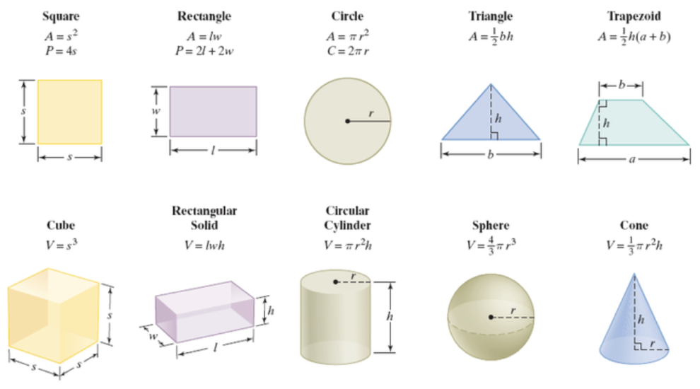

# Class

<br>

### Make some classes related about real life

```swift
class Dog {
    var name: String
    var age: Int
    var weight: Double
    var breed: String
    
    init(name: String, age: Int, weight: Double, breed: String) {
        self.name = name
        self.age = age
        self.weight = weight
        self.breed = breed
    }
    
    func bark(to someone: String) {
        print("Bark to \(someone)")
    }
    
    func eat(_ food: String) {
        print("Eat \(food)")
    }
}

var goldenRetriever = Dog(name: "Golden", age: 2, weight: 10.2, breed: "Golden Retriever")

goldenRetriever.bark(to: "theif")
goldenRetriever.eat("dog food")
```

```swift
class Student {
    var name: String
    var age: Int
    var school: String
    var grade: Int
    
    init(name: String, age: Int, school: String, grade: Int) {
        self.name = name
        self.age = age
        self.school = school
        self.grade = grade
    }
    
    func study(about subject: String) {
        print("Study about \(subject)")
    }
    
    func eat(_ food: String) {
        print("eat \(food)")
    }
    
    func sleep(for hour: Int) {
        hour == 1 ? print("sleep for an hour") : print("sleep for \(hour) hours")
    }
}

var soohanlee = Student(name: "Soohan Lee", age: 19, school: "JukJeon", grade: 3)

soohanlee.study(about: "Swift")
soohanlee.eat("Gukbap")
soohanlee.sleep(for: 1)
```

```swift
class Phone {
    var model: String
    var price: Int
    var haveFaceID: Bool
    
    init(model: String, price: Int, haveFaceID: Bool) {
        self.model = model
        self.price = price
        self.haveFaceID = haveFaceID
    }
    
    func call(to someone: String) {
        print("call to \(someone)")
    }
    
    func text(to someone: String) {
        print("text to \(someone)")
    }
}

let iPhone4 = Phone(model: "iPhone 4", price: 9900000, haveFaceID: false)
iPhone4.call(to: "Mom")
iPhone4.text(to: "Dad")
```

```swift
class coffee {
    var name: String
    var price: Int
    var origin: String
    
    init(name: String, price: Int, origin: String) {
        self.name = name
        self.price = price
        self.origin = origin
    }
}

let cafeLatte = coffee(name: "Cafe Latte", price: 3000, origin: "Ethiopia")
```

<br>

### Make Caculator with class

```swift
class Calculator {
    private var value = 0.0
    
    func add(_ number: Double) { value += number }
    
    func subtract(_ number: Double) { value -= number }
    
    func multiply(_ number: Double) { value *= number }
    
    func divide(_ number: Double) { value /= number }
    
    func reset() { value = 0 }
    
    func getValue() -> Double { value }
}

let calculator = Calculator()

calculator.add(10)
calculator.getValue()
// 10

calculator.add(5)
calculator.getValue()
// 15

calculator.subtract(9)
calculator.getValue()
// 6

calculator.subtract(10)
calculator.getValue()
// -4

calculator.multiply(4)
calculator.getValue()
// -16

calculator.multiply(-10)
calculator.getValue()
// 160

calculator.divide(10)
calculator.getValue()
// 16

calculator.reset()
calculator.getValue()
// 0
```

<br>

### Make some formulas with class



```swift
class Square {
    private var width: Double
    private var height: Double
    
    private var area: Double
    private var perimeter: Double
    
    init(width: Double) {
        self.width = width
        self.height = width
        
        area = width * height
        
        perimeter = 4 * width
    }
    
    func getArea() -> Double { area }
    func getPerimeter() -> Double { perimeter }
}

let square = Square(width: 13)
square.getArea()
// 169
square.getPerimeter()
//52

class Rectangle {
    private var width: Double
    private var height: Double
    
    private var area: Double
    private var perimeter: Double
    
    init(width: Double, height: Double) {
        self.width = width
        self.height = height
        
        area = width * height
        
        perimeter = (2 * width) + (2 * height)
    }
    
    func getArea() -> Double { area }
    func getPerimeter() -> Double { perimeter }
}

let rectangle = Rectangle(width: 5, height: 12)
rectangle.getArea()
// 60
rectangle.getPerimeter()
// 34

class Circle {
    private var radius: Double
    
    private var area: Double
    private var circumference: Double
    
    init(radius: Double) {
        self.radius = radius
        
        area = Double.pi * pow(radius, 2)
        
        circumference = 2 * Double.pi * radius
    }
    
    func getArea() -> Double { area }
    func getcircumference() -> Double { circumference }
}

let circle = Circle(radius: 6)
circle.getArea()
// 113.09733552923255
circle.getcircumference()
// 37.69911184307752

class Triangle {
    private var width: Double
    private var height: Double
    
    private var area: Double
    
    init(width: Double, height: Double) {
        self.width = width
        self.height = height
        
        area = width * height / 2
    }
    
    func getArea() -> Double { area }
}

let triangle = Triangle(width: 3, height: 14)
triangle.getArea()
// 21

class Trapezoid {
    private var upperWidth: Double
    private var lowerWidth: Double
    private var height: Double
    
    private var area: Double
    
    init(upperWidth: Double, lowerWidth: Double, height: Double) {
        self.upperWidth = upperWidth
        self.lowerWidth = lowerWidth
        self.height = height
        
        area = 0.5 * height * (upperWidth + lowerWidth)
    }
    
    func getArea() -> Double { area }
}

let trapezoid = Trapezoid(upperWidth: 3, lowerWidth: 2, height: 5)
trapezoid.getArea()
// 12.5

class Cube {
    private var width: Double
    private var height: Double
    private var depth: Double
    
    private var volume: Double
    
    init(width: Double) {
        self.width = width
        self.height = width
        self.depth = width
        
        volume = width * height * depth
    }
    
    func getVolume() -> Double { volume }
}

let cube = Cube(width: 7)
cube.getVolume()
// 343

class RectangularSolid {
    private var width: Double
    private var height: Double
    private var depth: Double
    
    private var volume: Double
    
    init(width: Double, height: Double, depth: Double) {
        self.width = width
        self.height = height
        self.depth = depth
        
        volume = width * height * depth
    }
    
    func getVolume() -> Double { volume }
}

let rectangularSolid = RectangularSolid(width: 3, height: 2, depth: 5)
rectangularSolid.getVolume()
// 30

class CircularCylinder {
    private var radius: Double
    private var height: Double
    
    private var volume: Double
    
    init(radius: Double, height: Double) {
        self.radius = radius
        self.height = height
        
        volume = Double.pi * pow(radius, 2) * height
    }
    
    func getVolume() -> Double { volume }
}

let circularCylinder = CircularCylinder(radius: 3, height: 6)
circularCylinder.getVolume()
// 169.64600329384882

class Sphere {
    private var radius: Double
    
    private var volume: Double
    
    init(radius: Double) {
        self.radius = radius
        
        volume = 4 / 3 * Double.pi * pow(radius, 3)
    }
    
    func getVolume() -> Double { volume }
}

let sphere = Sphere(radius: 2)
sphere.getVolume()
// 33.510321638291124

class Cone {
    private var height: Double
    private var radius: Double

    private var volume: Double
    
    init(height: Double, radius: Double) {
        self.height = height
        self.radius = radius
        
        volume = 1 / 3 * Double.pi * pow(radius, 2) * height
    }
    
    func getVolume() -> Double { volume }
}

let cone = Cone(height: 2, radius: 3)
cone.getVolume()
// 18.84955592153876
```

