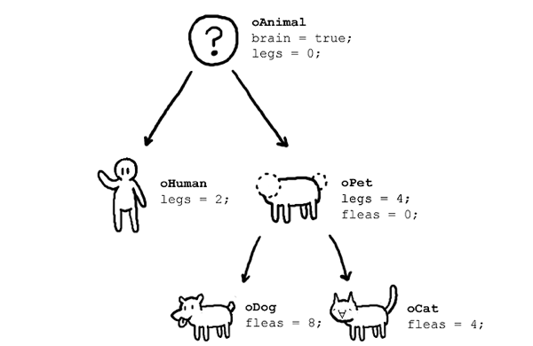

# Class

<br>

### Make this picture to a class with inheritance



```swift
class Animal {
    var brain = true
    var legs: Int
    
    init(legs: Int) {
        self.legs = legs
    }
}

class Human: Animal {
    override init(legs: Int) {
        super.init(legs: legs)
    }
}

class Pet: Animal {
    var fleas: Int
    
    init(fleas: Int) {
        self.fleas = fleas
        super.init(legs: 4)
    }
}

class Dog: Pet {
    override init(fleas: Int) {
        super.init(fleas: fleas)
    }
}

class Cat: Pet {
    override init(fleas: Int) {
        super.init(fleas: fleas)
    }
}

let animal = Animal(legs: 0)
animal.brain
// ture
animal.legs
// 0

let human = Human(legs: 2)
human.brain
// true
human.legs
// 2

let pet = Pet(fleas: 0)
pet.brain
// true
pet.legs
// 4
pet.fleas
// 0

let dog = Dog(fleas: 8)
dog.brain
// true
dog.legs
// 4
dog.fleas
// 8

let cat = Cat(fleas: 4)
cat.brain
// true
cat.legs
// 4
cat.fleas
// 4
```

